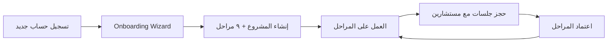
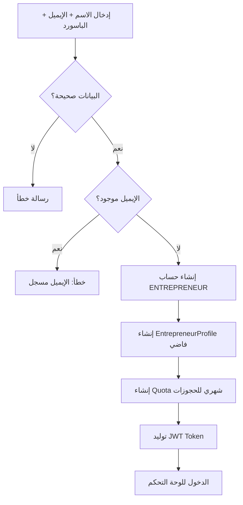
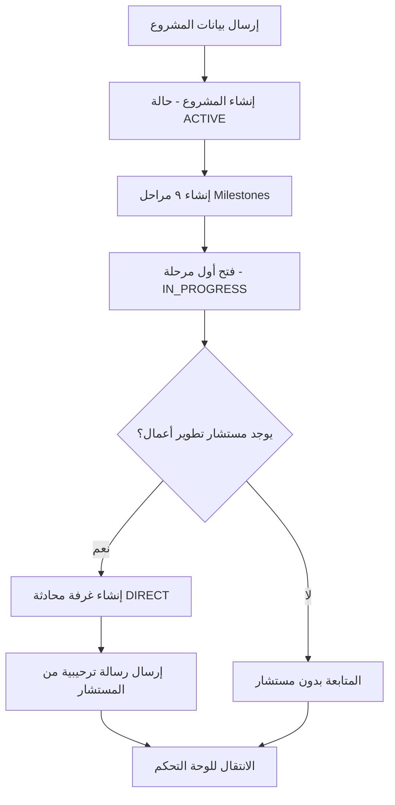
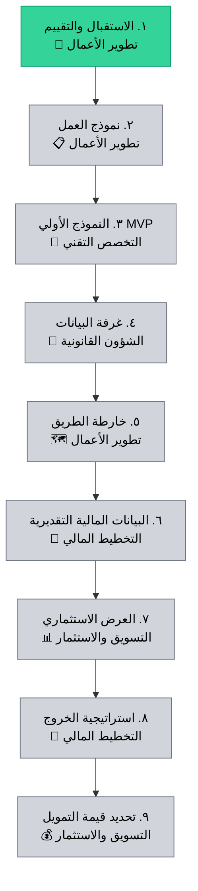
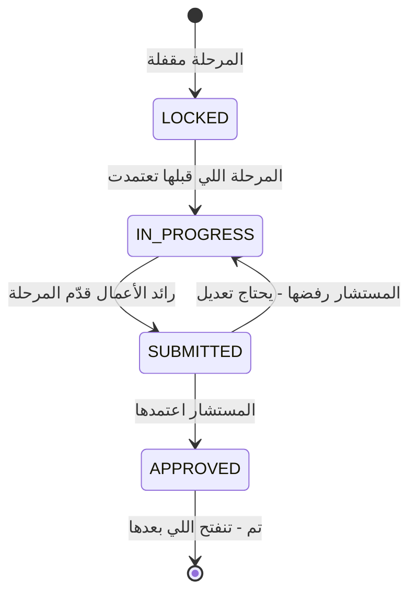
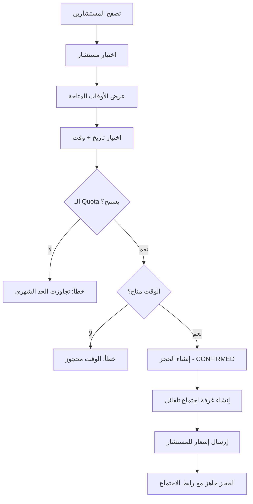
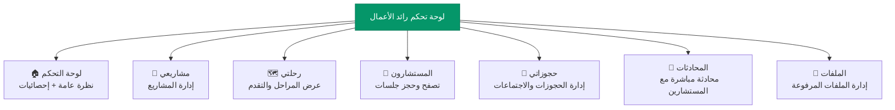
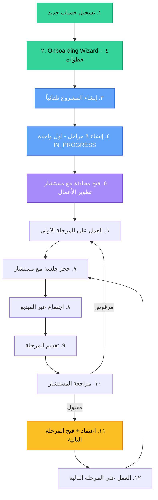
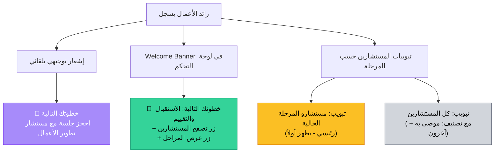

# رحلة رائد الأعمال في منصة مَسَار

> وثيقة توضح الرحلة الكاملة لرائد الأعمال من لحظة التسجيل حتى إكمال جميع المراحل

---

## نظرة عامة

منصة مَسَار هي حاضنة رقمية تربط رواد الأعمال بمستشارين متخصصين عبر رحلة مهيكلة من ٩ مراحل. كل مرحلة تحتاج اعتماد من مستشار متخصص قبل الانتقال للمرحلة التالية.

---

## المرحلة ١: التسجيل

رائد الأعمال يسجل من صفحة الهبوط عبر `POST /api/auth/register`

### ما يحدث تلقائياً:

- ينشاء حساب بدور `ENTREPRENEUR`
- ينشاء `EntrepreneurProfile` فاضي
- ينشاء له `Quota` شهري للحجوزات بقيمة من إعدادات المنصة

---

## المرحلة ٢: Onboarding Wizard

بعد أول تسجيل دخول، يظهر wizard من ٤ خطوات يجمع معلومات المشروع:

| الخطوة | السؤال | مطلوب؟ | التفاصيل |
|--------|--------|--------|----------|
| ١ | **ماهو اسم فكرتك؟** | ✅ نعم | نص حر، حتى ١٠٠ حرف |
| ٢ | **ما المجال؟** | ✅ نعم | ١٥ خيار: تقنية، صحة، تعليم، فنتك، تجارة إلكترونية، أغذية، عقارات، سياحة، لوجستيات، طاقة، إعلام، تصنيع، زراعة، تأثير اجتماعي، أخرى |
| ٣ | **وصف المشروع** | ❌ اختياري | نص حر |
| ٤ | **مرحلة المشروع** | ✅ نعم | ٥ خيارات: فكرة / نموذج أولي / MVP / تشغيل / توسع |

---

## المرحلة ٣: إنشاء المشروع تلقائياً

لما يكمل الـ Wizard، النظام يسوي الآتي في **transaction واحد** عبر `POST /api/projects`:

### ما يحدث بالتفصيل:

1. **ينشئ المشروع** بحالة `ACTIVE` و `onboardingCompleted: true`
2. **ينشئ ٩ مراحل** كلها `LOCKED` ما عدا الأولى `IN_PROGRESS`
3. **يبحث عن مستشار** من تخصص اول مرحلة - تطوير الأعمال
4. **ينشئ غرفة محادثة DIRECT** بين رائد الأعمال والمستشار
5. **يرسل رسالة ترحيبية** تلقائية من المستشار

---

## المرحلة ٤: رحلة المراحل - Milestones

### المراحل الـ ٩ بالترتيب:

### التخصصات المرتبطة بكل مرحلة:

| # | المرحلة | التخصص المطلق للاعتماد |
|---|---------|----------------------|
| ١ | الاستقبال والتقييم | تطوير الأعمال |
| ٢ | نموذج العمل - Business Model Canvas | تطوير الأعمال |
| ٣ | النموذج الأولي - MVP | التخصص التقني |
| ٤ | غرفة البيانات - Data Room | الشؤون القانونية |
| ٥ | خارطة الطريق - Roadmap | تطوير الأعمال |
| ٦ | البيانات المالية التقديرية - Financials | التخطيط المالي |
| ٧ | العرض الاستثماري - Pitch Deck | التسويق والاستثمار |
| ٨ | استراتيجية الخروج - Exit Strategy | التخطيط المالي |
| ٩ | تحديد قيمة التمويل - The Ask | التسويق والاستثمار |

### حالات كل مرحلة:

| الحالة | اللون | المعنى |
|--------|-------|--------|
| 🔒 LOCKED | رمادي | مقفلة - لا يمكن العمل عليها |
| 🔵 IN_PROGRESS | أزرق | مفتوحة ويعمل عليها رائد الأعمال |
| 🟡 SUBMITTED | أصفر | قدّمها للمستشار للمراجعة |
| 🟢 APPROVED | أخضر | المستشار اعتمدها - تنفتح اللي بعدها |

---

## المرحلة ٥: الحجز مع مستشار

رائد الأعمال يقدر يحجز جلسة استشارية مع أي مستشار:

### آلية الحجز:

- يختار **مستشار** - يقدر يصفّي حسب التخصص
- يشوف **أوقات المتاحة** اللي المستشار حددها
- يحجز **تاريخ + وقت** - النظام يتحقق من Quota ومن تعارض الأوقات
- ينشاء **غرفة اجتماع** تلقائياً مع رابط
- المستشار يتلقى **إشعار** بالحجز الجديد

---

## لوحة تحكم رائد الأعمال

بعد الـ Onboarding، يظهر Dashboard مع ٧ أقسام:

| القسم | الأيقونة | الوظيفة |
|-------|----------|---------|
| لوحة التحكم | 🏠 | نظرة عامة على المشروع والإحصائيات |
| مشاريعي | 💼 | إدارة المشاريع - إضافة / تعديل / أرشفة |
| رحلتي | 🗺️ | عرض المراحل وتقدمها + رفع ملفات + تقديم للاعتماد |
| المستشارون | 👥 | تصفح المستشارين وحجز جلسات |
| حجوزاتي | 📅 | عرض وإدارة الحجوزات + دخول الاجتماع |
| المحادثات | 💬 | محادثة مباشرة مع المستشارين |
| الملفات | 📁 | إدارة الملفات المرفوعة لكل مرحلة |

---

## الرحلة الكاملة - ملخص

---

## نظام التوجيه والإرشاد

لضمان أن رائد الأعمال يعرف خطوته التالية دائماً، تم إضافة ٣ طبقات من التوجيه:

### ١. إشعار توجيهي تلقائي (بعد إنشاء المشروع)

عند إنشاء مشروع جديد عبر `POST /api/projects`، النظام يرسل إشعار تلقائي:

> 🎯 خطوتك التالية
> احجز جلسة استشارية مع أحد مستشاري تخصص "تطوير الأعمال" لبدء مرحلة "الاستقبال والتقييم". اذهب لصفحة المستشارين واختر الأنسب لك!

### ٢. Welcome Banner (في لوحة التحكم)

يظهر في `EntrepreneurOverview` عندما يكون عند رائد الأعمال مرحلة حالية `IN_PROGRESS` ولا يوجد حجوزات مؤكدة:

- يعرض اسم المرحلة الحالية + التخصص المطلوب
- زر **"تصفح المستشارين"** → يوديه لصفحة المستشارين
- زر **"عرض المراحل"** → يوديه لصفحة الرحلة
- يختفي تلقائياً لما يحجز أول جلسة

### ٣. تبويبات المستشارين (صفحة المستشارين)

صفحة المستشارين فيها تبويبين:

| التبويب | الوصف |
|---------|-------|
| **مستشارو المرحلة الحالية** (رئيسي) | يعرض فقط مستشارين تخصص المرحلة الحالية + شارة "⭐ موصى به لمرحلتك الحالية" + بانر معلوماتي عن المرحلة |
| **كل المستشارين** | يعرض كل المستشارين مصنفين: الموصى بهم أولاً + البقية + بحث وفلترة بالتخصص |

---

## الملفات والمسارات المهمة في الكود

| الملف | الوظيفة |
|-------|---------|
| `src/components/entrepreneur/OnboardingWizard.tsx` | واجهة الـ Wizard لجمع بيانات المشروع |
| `src/components/entrepreneur/EntrepreneurDashboard.tsx` | لوحة تحكم رائد الأعمال + Welcome Banner + تبويبات المستشارين |
| `src/app/api/auth/register/route.ts` | API التسجيل |
| `src/app/api/projects/route.ts` | API إنشاء المشاريع + المراحل + الإشعار التوجيهي |
| `src/app/api/milestones/route.ts` | API عرض المراحل والتقدم |
| `src/app/api/bookings/route.ts` | API الحجوزات |
| `src/app/api/bookings/availability/route.ts` | API أوقات توفر المستشارين |
| `src/app/api/consultants/route.ts` | API عرض المستشارين |
| `src/app/api/notifications/route.ts` | API الإشعارات |
| `src/lib/seed.ts` | البيانات الأولية - التخصصات والمراحل الـ ٩ |
| `prisma/schema.prisma` | هيكل قاعدة البيانات |
| `src/lib/store.ts` | إدارة حالة التطبيق - Zustand |

